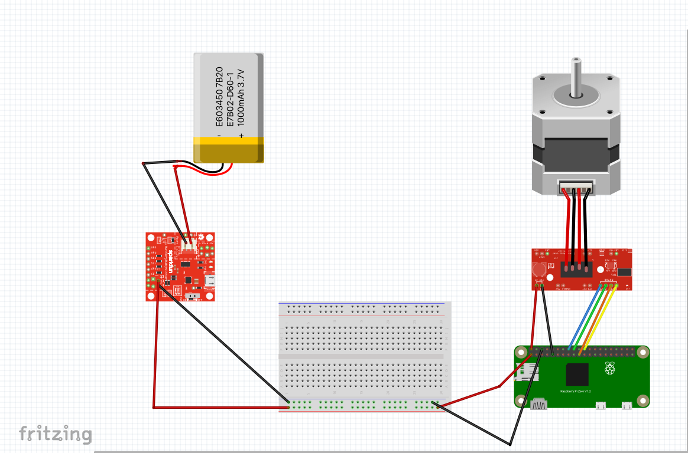

# SunneeD Build

## Parts

* Raspberry Pi 0w

* ULN2003 Stepper Motor and Driver

* SparkFun Battery Babysitter

* LiPo 1000mAh battery

* Pixy2 Camera

* Breadboard (1/2+)

## Wiring

### Raspberry Pi 0w Pinmap
* All pin #'s below refernce this pinmap

| Pi pin | Connection |
| :----- | :-------   |
| 1      | 3.3v in (from battery)    |
| 2      | 5v out (to stepper driver) |
| 6      | GND (in from battery) |
| 9      | GND (out to stepper driver)|
| 16     | Stepper driver In1 |
| 18     | Stepper driver In2 |
| 19     | Stepper driver In4 |
| 22     | Stepper driver In3 |