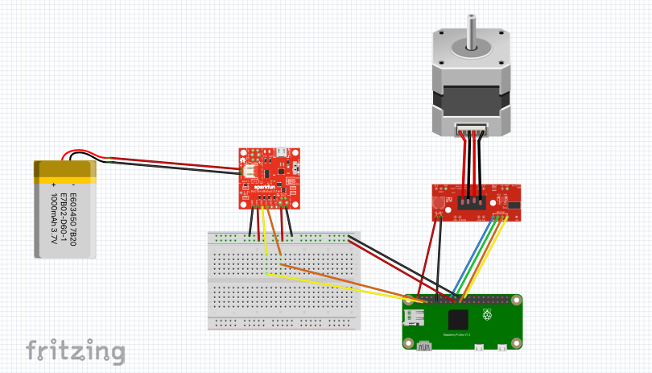

# SunneeD Build

## Parts

* Raspberry Pi 0w

* ULN2003 Stepper Motor and Driver

* SparkFun Battery Babysitter

* LiPo 1000mAh battery

* Pixy2 Camera

* Breadboard (1/2+)

## Wiring

**Note: the system should be powered by the battery babysitter and not a micro-usb connection to the Pi. Otherwise the i2c connection between the babysitter and Pi may not work.**

### Raspberry Pi 0w Pinmap
* All pin #'s below refernce this pinmap

| Pi pin | Connection |
| :----- | :-------   |
| 2      | 5v out (to stepper driver) |
| 3      | SDA (from babysitter)   |
| 5      | SCL (from babysitter)  |
| 9      | GND (out to stepper driver)|
| 16     | Stepper driver In1 |
| 17     | 3.3v In (battery)  |
| 18     | Stepper driver In2 |
| 19     | Stepper driver In4 |
| 20     | GND (battery)      |
| 22     | Stepper driver In3 |