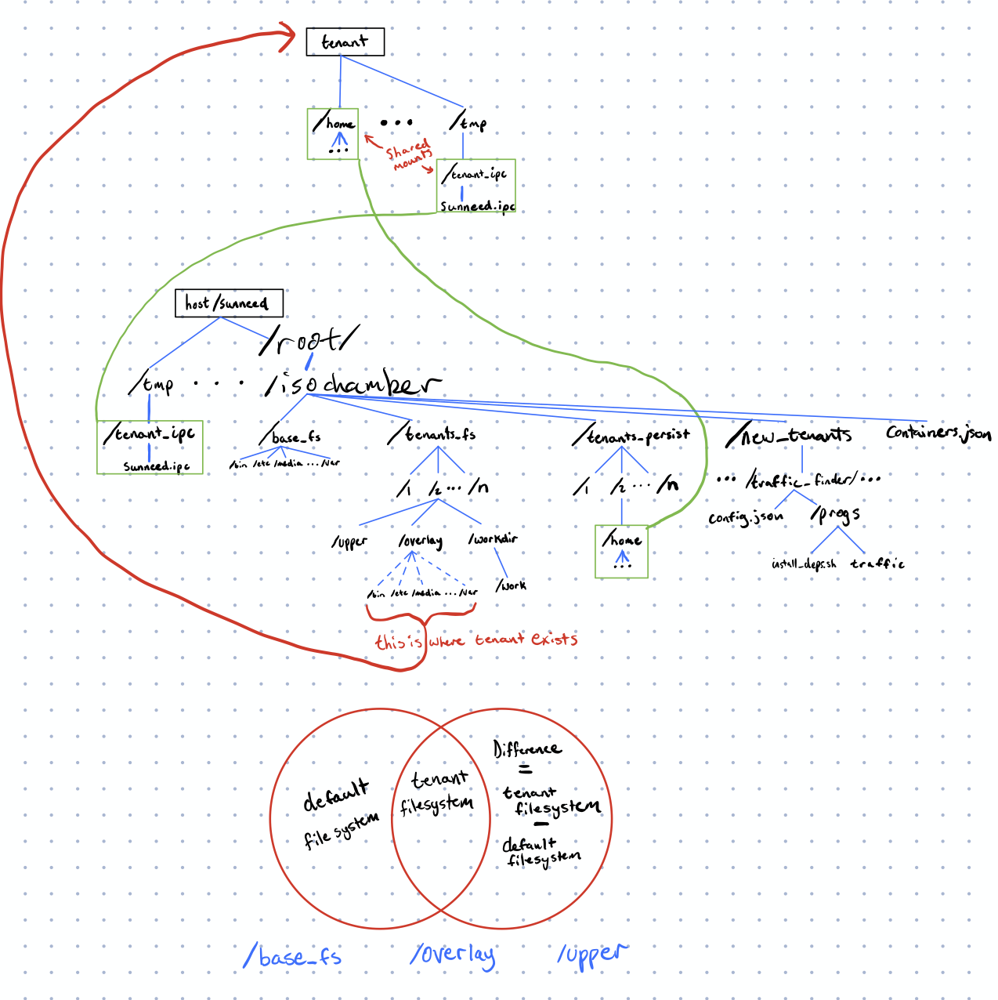

# System overview:

This overview is meant to provide a higher level understanding of the Isochamber system structure. To understand how to use the program see the [README.md](../README.md). To dive deeper into the code, see the [code documentation](./isochamber_documentation.md).



Isochamber is designed to set up and contain tenant containers on the host system, Sunneed. The diagram above illustrates the relationship between the host and tenant file systems. 

`/root/isochamber/` design:

* `containers.json`:
  
* This json file is how the host keeps track of configured tenant containers installed on the system. It holds the container's id, name, path to dependencies, and path to executables. Entries are added to `containers.json` during tenant configuration. 
  
* `new_tenants/`:

  * This is where new tenant containers are placed manually by the developer (eventually this could be replaced with an automated script that places it here once a tenant sends us their tenant package). We give the tenant a blank tenant package which includes an unfilled out json file, `config.json`, a `progs/` folder, and within that, `install_deps.sh`. More information about setting up this tenant package can be found in step 3 in the [`README.md`](./README.md) . In summary, `config.json` specifies a container name and tells `handoff.c` what program to execute within the container and `install_deps.sh` specifies library dependencies needed for program execution. 
  * `progs/` initially only holds the dependency installation script. This is where the tenant can place any files or objects necessary for their program to run. During tenant configuration, the entire contents of `progs/` is dumped into `isochamber/tenants_persist/<tid>/home/`. 

* `tenants_persist/`:

  * This directory holds one directory named by tenant id for each tenant. It exists because during the design of Isochamber, we decided that only the tenant's `/home/` directory should persist across successive executions of their container. At first, the entire file system was deleted after the container was done running. However, this creates an issue with letting tenants install dependencies to their containers as these would have to be reinstalled each time with that design. As of now, the tenant filesystem is unmounted after the container runs, but not deleted. In the way that the tenant fs is mounted with an overlay mount, this is not necessarily too much overhead (this will be discussed further below). Even with this design change, the `tenants_persist/` directory remains useful. In `handoff.c`, during the container spawn process, the tenant mounts and binds `tenants_persist/<tid>/home/` to their own `/home/` directory. This means that this directory can be used during development/debugging/testing to add or remove files from the tenant's `/home/` directory without reconfiguring the tenant. 

* OverlayFS -

  * Sunneed needs to be able to support a multitutde of containers on its system. Keeping a whole seperate filesystem for each tenant would create far too much overhead for the host system. OverlayFS helps to solve this problem. OverlayFS works by letting the tenant process mount what appears to be a whole filesystem that is actually broken up into layers. These layers include a lower directory, an upper directory, an overlay directory, and a work directory. The lower directory holds all the default filesystem data. The overlay directory is a union mount of the lower and upper directorys. The overlay appears to be a standalone filesystem to the tenant. Added or deleted files are held/recorded in the upper directory. The work directory holds metadata for the OverlayFS union mount implentation.

    Here is some useful [documentation](https://wiki.archlinux.org/index.php/Overlay_filesystem).

  * `base_fs/`:

    * This directory acts as the lower directory for the OverlayFS union mount. This is where the default base debian buster file system is installed on the host. This is done using a program called Debootstrap. Debootstrap allows you to choose an OS ***SUITE***, install it to ***TARGET***, from a ***MIRROR*** (see [debootstrap(8)](https://manpages.debian.org/buster/debootstrap/debootstrap.8.en.html)). This debootstrap process takes place during execution of `build.py`:

      ```
      debootstrap SUITE TARGET MIRROR
      debootstrap buster /root/isochamber/base_fs/ http://ftp.us.debian.org/debian
      ```

      Additionally, an system architecture can be specified if you want to install a filesystem for a different system architecture than the host (see [debootstrap(8)](https://manpages.debian.org/buster/debootstrap/debootstrap.8.en.html)). 

      This directory is mounted by every tenant as the lower directory for their overlay mount. This saves overhead by only actually having one copy of the filesystem on the host while each tenant has their own unique view of it. 

  * `tenants_fs/`:

    * There is one directory for each installed tenant container named by the tenant id. Under each `tenants_fs/<tid>/` are three directories:

      * `upper/` - This is the upperdir mount for the OverlayFS mount. This is where added files are stored and deleted files are stored. This contains changes that propogate during tenant execution.

      * `workdir/` - This directory is the workdir for the OverlayFS mount and holds metadata only used by OverlayFS.

      * `overlay/` - This is the actual root mount point for tenants. This is their whole view of the filesystem.

        This is why the red arrow connects `~/overlay/` to the tenant `/` in the diagram above. During execution of `handoff.c`, when launching a container, the processes root directory is pivoted to this `overlay/` directory. The host file system is then pivoted to a subdirectory of `overlay/`, which is now the process's `/` directory. This directory, `/.old/` is then deleted and unmounted so that the tenant can no longer have any access to the host filesystem. 

* `/tmp/tenant_ipc/`:

  * This directory is essential for IPC between Sunneed and the tenant. Sunneed uses a named pipe `/tenant_ipc/sunneed.ipc` which is stored here. To be able to communicate with the host, the tenant also needs access to this pipe. To achieve this, the exec-ing process in `handoff.c` binds to the host's `/tmp/tenant_ipc/` directory as a shared, read-only mount during filesystem setup. This ensures that both the tenant and the host have access to the pipe while ensuring a malicious tenant couldn't delete the pipe from the host, and therefore all tenants. 

    During initial design, this binded mount was supposed to be a slave mount so that changes only propogated from the host to the tenant. This would allow a tenant to delete their own .ipc file without affecting other tenants or the host. I could not get slave mounts working no matter what I tried. However, this could possibly be a slightly better design. 

    This directory is created when `build/sunneed` is run from Sunneed's root directory. A tenant trying to mount `/tmp/tenant_ipc/` will fail if this hasn't been run yet.

    

